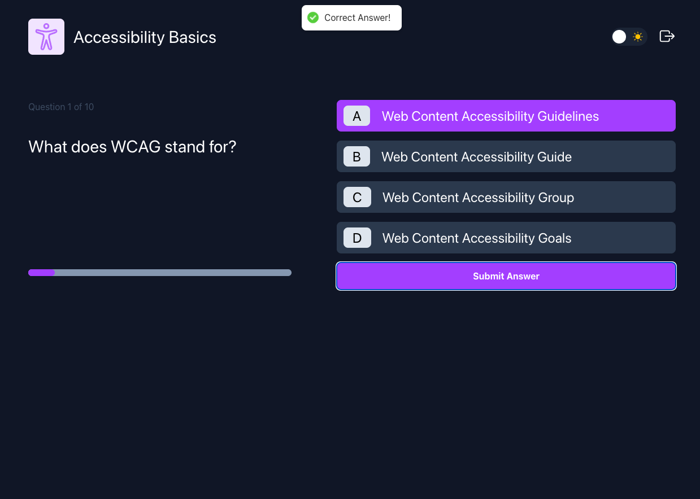

This is a [Next.js](https://nextjs.org) project bootstrapped with [`create-next-app`](https://nextjs.org/docs/app/api-reference/cli/create-next-app).

## Getting Started

First, run the development server:

```bash
npm run dev
# or
yarn dev
# or
pnpm dev
# or
bun dev
```

Open [http://localhost:3000](http://localhost:3000) with your browser to see the result.

You can start editing the page by modifying `app/page.tsx`. The page auto-updates as you edit the file.

This project uses [`next/font`](https://nextjs.org/docs/app/building-your-application/optimizing/fonts) to automatically optimize and load [Geist](https://vercel.com/font), a new font family for Vercel.

## Learn More

To learn more about Next.js, take a look at the following resources:

- [Next.js Documentation](https://nextjs.org/docs) - learn about Next.js features and API.
- [Learn Next.js](https://nextjs.org/learn) - an interactive Next.js tutorial.

You can check out [the Next.js GitHub repository](https://github.com/vercel/next.js) - your feedback and contributions are welcome!

## Deploy on Vercel

The easiest way to deploy your Next.js app is to use the [Vercel Platform](https://vercel.com/new?utm_medium=default-template&filter=next.js&utm_source=create-next-app&utm_campaign=create-next-app-readme) from the creators of Next.js.

Check out our [Next.js deployment documentation](https://nextjs.org/docs/app/building-your-application/deploying) for more details.

# 🎯 Quizly - Interactive Quiz Platform

A modern, full-stack quiz application built with Next.js that allows users to create custom quizzes and engage in interactive learning experiences.


## ✨ Features

- **User Authentication** - Secure sign-in and sign-up with Clerk
- **Custom Quiz Builder** - Create quizzes with unlimited questions
- **Question Editor** - Add questions with multiple choice options
- **Icon Customization** - Choose from a variety of icons for your quizzes
- **Edit & Update** - Modify existing quizzes anytime
- **Delete Management** - Remove quizzes you no longer need

### 🔐 User Management

- **Secure Authentication** - Powered by Clerk for robust user management
- **Personal Dashboard** - Manage all your created quizzes in one place
- **Protected Routes** - Secure quiz creation and management areas

### 🎨 User Experience

- **Dark/Light Mode** - Toggle between themes for comfortable viewing
- **Responsive Design** - Seamless experience across all devices
- **Real-time Notifications** - Toast notifications for user actions
- **Intuitive Navigation** - Clean, user-friendly interface

## 🚀 Getting Started

### Prerequisites

- Node.js (v18 or higher)
- npm, yarn, pnpm, or bun
- MongoDB database
- Clerk account for authentication

### Installation

1. **Clone the repository**

   ```bash
   git clone https://github.com/yourusername/quizly.git
   cd quizly
   ```

2. **Install dependencies**

   ```bash
   npm install
   # or
   yarn install
   # or
   pnpm install
   # or
   bun install
   ```

3. **Set up environment variables**
   Create a `.env.local` file in the root directory:

   ```env
   # Clerk Authentication
   NEXT_PUBLIC_CLERK_PUBLISHABLE_KEY=your_clerk_publishable_key
   CLERK_SECRET_KEY=your_clerk_secret_key
   NEXT_PUBLIC_CLERK_SIGN_IN_URL=/sign-in
   NEXT_PUBLIC_CLERK_SIGN_UP_URL=/sign-up

   # Database
   MONGODB_URI=your_mongodb_connection_string

   # API
   NEXT_PUBLIC_API_BASE_URL=http://localhost:3000
   ```

4. **Run the development server**

   ```bash
   npm run dev
   # or
   yarn dev
   # or
   pnpm dev
   # or
   bun dev
   ```

5. **Open your browser**
   Navigate to [http://localhost:3000](http://localhost:3000)

## Screenshots

### 

### 

### 

### 

### 

### 

### 

## 🛠️ Tech Stack

### Frontend

- **Next.js 15** - React framework with App Router
- **React 19** - UI library
- **TypeScript** - Type safety
- **Tailwind CSS** - Utility-first styling
- **React Hot Toast** - Notifications
- **React Icons** - Icon library

### Backend

- **Next.js API Routes** - Server-side API
- **Node.js** - JavaScript runtime
- **MongoDB** - Database

### Authentication

- **Clerk** - User authentication and management

## 🔧 API Endpoints

```typescript
GET    /api/quizzes?userId=...  // Get all quizzes
POST   /api/quizzes          // Create a new quiz
PUT    /api/quizzes?id=...   // Update a quiz
DELETE /api/quizzes?id=...   // Delete a quiz
```

**Happy Quizzing! 🎉**
